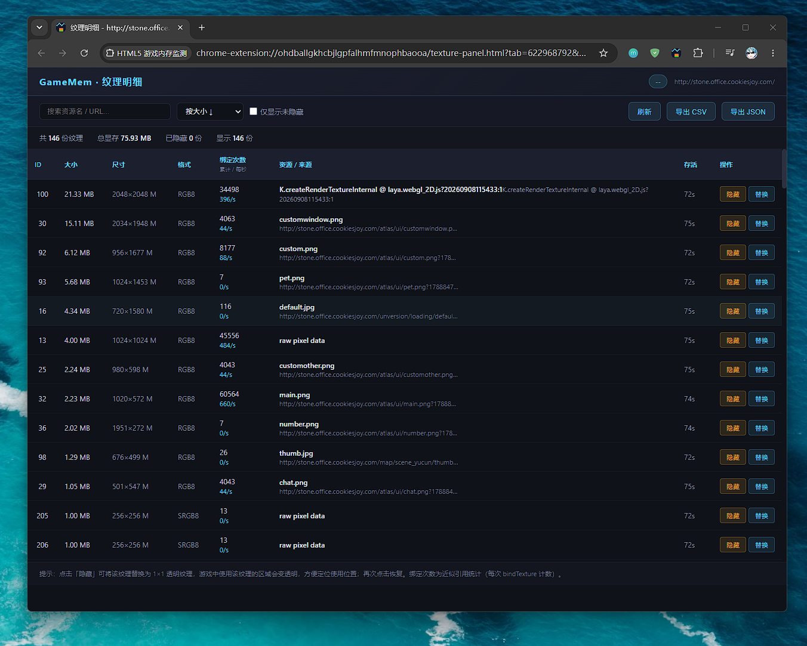
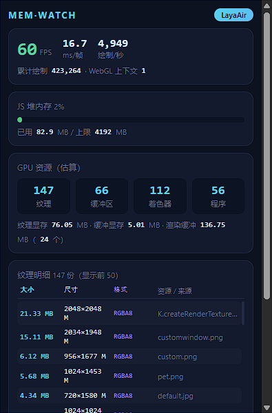

# HTML5 游戏内存监测（Chrome / Edge 扩展）

一个 Manifest V3 浏览器扩展：实时监测 HTML5 游戏页面的 **JS 堆内存**、**WebGL 资源（纹理 / 缓冲区 / 着色器 / 程序）**、**FPS / 帧耗时** 与 **绘制调用**，并自动识别常见游戏引擎。

> 需要 Chrome / Edge **111+**（动态注册 MAIN world 内容脚本）。Firefox 暂不适配（`performance.memory` 与动态 MAIN world 注册均不可用，JS 堆内存一栏会显示 `--`）。
>
> **默认不注入任何页面**：安装时不申请任何网站权限，只在用户指定的网站或点击扩展图标时启用；页面内 HUD 默认关闭。

## 启用方式与权限

扩展有两种启用方式，按需选择：

**方式一：常驻白名单（推荐常用游戏站）**

1. 右键扩展图标 → 「选项」，或点击弹窗底部的「白名单」按钮；
2. 输入域名（如 `example.com`、`*.example.com`、`localhost`）并确认授权。

白名单网站每次打开页面都会在**游戏脚本运行之前**（`document_start`，页面主世界）自动注入，可统计到页面加载的全部资源。授权按站点单独申请（optional host permissions），删除条目时同步收回授权。

**方式二：点击扩展图标（临时监测）**

点击工具栏图标打开弹窗时，通过 `activeTab` 向当前页面临时注入，只统计**注入之后**创建的资源，关闭不保留、不申请任何常驻权限。适合偶尔查看、或临时排查某个站点。

**页面内 HUD**：默认关闭。在弹窗中点击「显示 HUD」开启后会跨页面记住；点击 HUD 上的 `×` 关闭后不再自动弹出，可随时从弹窗重新打开。

## 功能

| 指标 | 来源 | 说明 |
| --- | --- | --- |
| JS 堆内存 | `performance.memory`（仅 Chrome 系） | 已用 / 总 / 上限，含占比进度条 |
| FPS / 帧耗时 | 挂钩 `requestAnimationFrame` | 每秒结算，帧耗时 EMA 平滑 |
| 绘制调用 | 挂钩 `drawArrays / drawElements`（含 Instanced / Range） | 累计 + 每秒速率 |
| 纹理数量与估算显存 | 挂钩 `texImage2D / texImage3D / texStorage2D / texStorage3D / compressedTexImage2D / compressedTexImage3D / generateMipmap / deleteTexture` | 按格式与尺寸估算，含 WebGL2 3D 纹理 / 2D 数组纹理 |
| 纹理来源（创建/上传位置） | 捕获 `createTexture` 和首次 `texImage2D / texImage3D / texStorage*` 的调用栈，解析函数名 / 文件 / 行号 | 弹窗纹理明细列表，按显存降序，悬停查看完整栈 |
| 渲染缓冲（Renderbuffer） | 挂钩 `createRenderbuffer / deleteRenderbuffer / renderbufferStorage / renderbufferStorageMultisample` | 数量与估算显存，含多重采样倍数 |
| 缓冲区数量与估算显存 | 挂钩 `bufferData / bufferSubData / deleteBuffer` | 按字节数统计 |
| 着色器 / 程序 | 挂钩 create/delete | 存活数量 |
| 引擎识别 | 检测全局对象 | Phaser / PixiJS / Three.js / Babylon.js / Cocos / LayaAir / CreateJS / PlayCanvas / melonJS / Unity WebGL |

## 截图预览

### 弹窗面板



实时显示 JS 堆内存、纹理数量与显存、FPS、帧耗时、绘制调用，以及纹理明细列表（含资源名称与加载地址）。

### 纹理明细面板



全量纹理列表，支持搜索、排序、显隐调试、素材替换、绑定次数统计，以及 CSV/JSON 导出。

## 安装

1. 打开 `chrome://extensions`（Edge 为 `edge://extensions`）；
2. 打开右上角 **开发者模式**；
3. 点击 **加载已解压的扩展程序**，选择本目录 `html5-game-memory-monitor`；
4. 打开 HTML5 游戏页面后**点击扩展图标**即可临时监测；常用游戏站建议按上文加入白名单（或打开 `demo/game.html` 体验）。

> 白名单网站的页面在安装扩展**之前**已打开的，需要刷新一次才会注入。
> 若要监测 `file://` 打开的本地页面：先在扩展详情页开启 **“允许访问文件网址”**，再在白名单中添加 `file:///*`。

## 演示页

```bash
# 方式一：直接双击 demo/game.html（需开启 file 访问权限）
# 方式二：本地起一个静态服务
python -m http.server 8000 --directory demo
# 访问 http://localhost:8000/game.html
```

演示页每 1.5 秒创建一张 256×256 RGBA 纹理（约 0.25MB，含 mipmap 约 0.33MB），累积到 60 张后停止，便于观察纹理数量与估算显存随时间的增长。

## 架构

```
页面（主世界 Main World）                扩展（隔离世界）                弹窗
┌───────────────────────┐   postMessage   ┌────────────────────┐  chrome.runtime  ┌──────────┐
│ hook.js               │ ───────────────▶ │ content.js         │ ───────────────▶ │ popup    │
│ 挂钩 getContext/WebGL │  快照 500ms/次   │ 缓存快照           │  get-stats/reset │ 渲染+折线 │
│ 统计资源/绘制/FPS     │ ◀─────────────── │ 采样 JS 堆         │ ◀─────────────── │ 按钮     │
│ 识别引擎               │  控制消息(重置)  │ 响应控制消息        │                  │          │
└───────────────────────┘                  └────────────────────┘                  └──────────┘
        ▲
        │ 白名单：background.js 动态注册（document_start）
        │ 其他页：popup 以 activeTab 临时注入
```

- **manifest.json**：不含静态 `content_scripts`；声明 `scripting` / `storage` 权限与 `optional_host_permissions`（按站点授权，安装时零网站权限警告）。
- **background.js**：Service Worker。监听白名单（`chrome.storage.sync`）变化，用 `chrome.scripting.registerContentScripts` 把 hook.js（`world: "MAIN"`，`document_start`）与 content.js 动态注册到白名单网站，注册跨浏览器重启持久生效；已被用户撤销授权的站点自动跳过。
- **hook.js**：页面主世界挂钩脚本，`document_start` 同步执行时确保在页面任何脚本之前完成 WebGL API 挂钩（解决 Laya 等引擎早期初始化错过的问题）。挂钩 `WebGLRenderingContext` 与 `WebGL2RenderingContext`（含 3D 纹理 / 2D 数组纹理 / 渲染缓冲）。所有挂钩 try/catch 保护，不影响游戏运行。第一次 WebGL 方法调用自动激活统计（兜底：即使 `getContext` 被错过也能开始统计）；带 `__GAME_MEM_HOOK__` 防重复注入。
- **popup.js**：打开弹窗（点击扩展图标，`activeTab` 生效）时若当前页未注入，先用 `chrome.scripting.executeScript`（MAIN world + 隔离世界）临时注入，再开始拉取快照。
- **content.js**：隔离世界。接收 hook 快照、采样 JS 堆、响应弹窗消息。
- **options.js**：白名单管理。添加站点时在用户手势内同步 `chrome.permissions.request` 授权，写入 storage 由 background 统一注册；删除站点时同步 `permissions.remove` 收回授权。
- **popup**：纯前端弹窗，无外部依赖；用 Canvas 绘制 FPS / JS 堆 / 纹理显存三条趋势折线（最近约 45 秒）。

## 项目结构

```
html5-game-memory-monitor/
├── manifest.json          # MV3 清单（无静态 content_scripts，按站点可选授权）
├── background.js          # Service Worker：白名单 → 动态注册内容脚本
├── hook.js                # 主世界 WebGL 挂钩（核心）
├── content.js             # 隔离世界消息层
├── popup.html / popup.css / popup.js
├── options.html / options.css / options.js   # 常驻监测网站白名单
├── icons/                 # 16/48/128 图标（tools/gen_icons.py 生成）
├── demo/game.html         # 纹理增长演示页
├── tests/hook.test.js     # 单元测试（纯函数 + 伪造 WebGL 环境挂钩逻辑）
└── tools/gen_icons.py     # 图标生成脚本（纯标准库）
```

## 测试

```bash
node tests/hook.test.js
```

覆盖：格式→字节换算表、纹理/压缩纹理估算、纹理上传/删除/mipmap/texStorage2D 的显存增减、缓冲区字节统计、绘制调用计数、着色器/程序计数、重置消息、返回值不被破坏。

## 口径与已知限制

- **显存为估算值**：按 `internalFormat × 尺寸` 计算；`texSubImage2D` 部分更新按整幅重估；压缩格式按 4×4 块近似（ASTC/PVRTC 块尺寸不同）；纹理显存不含采样器状态与帧缓冲附件引用。
- **纹理来源为调用栈解析**：记录 `createTexture` 和首次 `texImage2D` 的调用位置（函数名 / 文件 / 行号）；若代码被压缩或混淆，函数名可能不直观；视频纹理等每帧重复上传只记录首次上传来源；快照最多携带显存最大的 50 份纹理明细。
- **JS 堆内存**：Chrome 独有 API；数字包含 GC 未回收部分，作为趋势参考而非精确占用。
- **点击图标临时注入**：只统计注入之后创建的资源（纹理等初始资源会缺失）；需要完整统计请使用白名单方式。
- **WebGPU 游戏**：暂未挂钩（可在 hook.js 中扩展 `navigator.gpu`）。
- **OffscreenCanvas** 中的 WebGL 上下文未追踪（可在 `getContext` 挂钩中扩展）。
- 白名单网站在安装扩展前已打开的页面不会自动注入，刷新即可。

## 扩展点

- 想加 WebGPU 统计：在 `hook.js` 挂钩 `navigator.gpu.requestAdapter`，统计 buffer/texture 分配。
- 想加音频内存：挂钩 `AudioContext` / `createBuffer`。
- 想加录制导出：popup 里把 `hist` 历史数据序列化导出 CSV/JSON。
